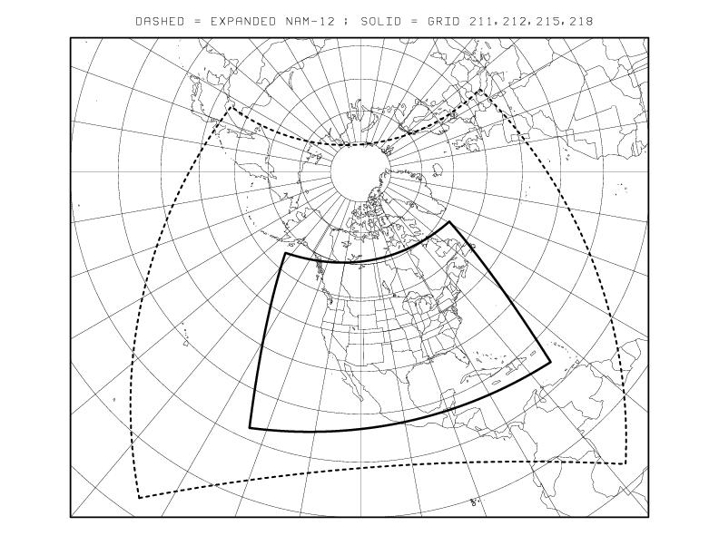
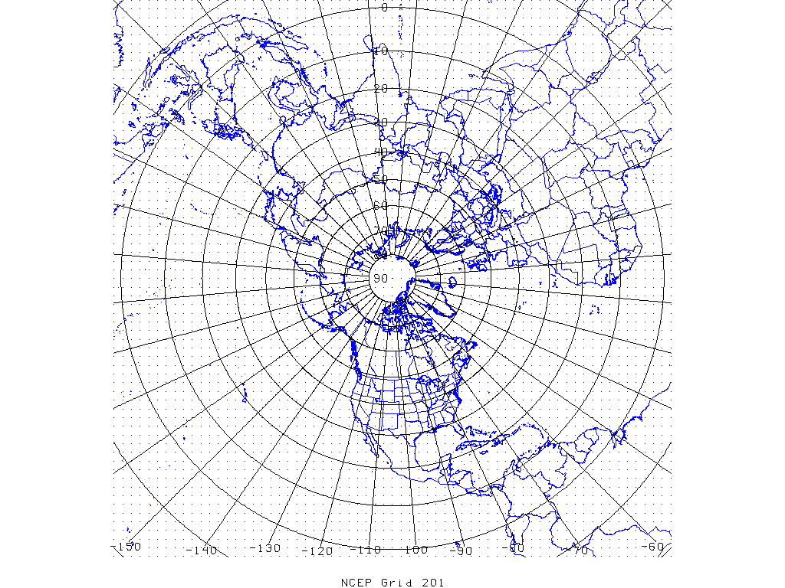
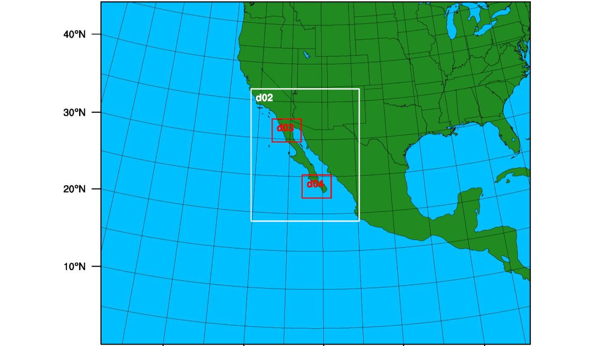
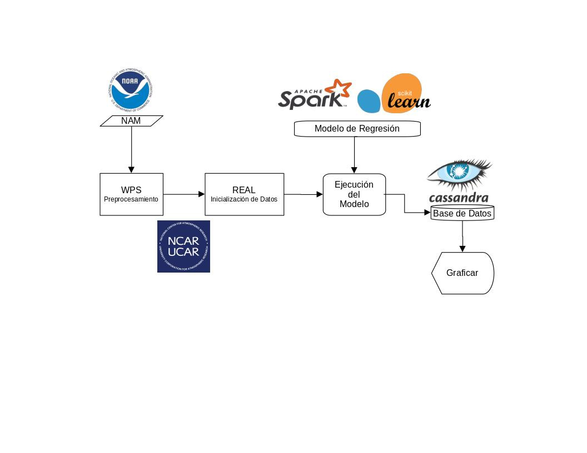

## Implementación de un modelo de predicción de temperatura

Proyecto realizado para la clase de Big Data de la Maestría en Ciencia de Datos de la Universidad de Sonora.
Tiene como principal objetivo el uso de herramientas de Big Data como Spark, Apache Superset y ML-Flow.

### Introducción

Sabemos que la predicción climática es un problema bastante complejo y aun no resuelto por completo, existen algunas soluciones que nos ofrecen aproximaciones bastance aceptables y que actualmente son usadas globalmente, entre ellas esta WRF (Weather Research and Forecasting), ECMWF (European Centre for Medium-Range Weather Forecast), RAP (Rapid-Refresh) entre otros.

### Planteamiento del problema

Si bien es cierto que los modelos de predicción antes mencionados ofrecen resultados aceptables por la comunidad estos requieren de bastante tiempo y poder de cómputo para procesarse en un tiempo razonable. Esto implica invertir una fuerte cantidad de dinero en recursos de hardware y personal calificado para su implementación.

### ¿Cómo funciona el modelo WRF?

Para generar una predicción utilizando este modelo es necesario seguir una serie de pasos que van desde la asimilación de datos hasta la propia ejecución del modelo. 

<figure>
  
  <figcaption>Fuente: https://www.j-kosham.or.kr/journal/view.php?doi=10.9798/KOSHAM.2018.18.2.445</figcaption>
<figure>
 
#### Datos de entrada 

Existen algunos modelos que generan las entradas para WRF, entre ellos se encuentran NAM (North American Mesoscale Forecast System), GFS (Global Forecast System) y ECMWF (European Centre for Medium-Range Weather Forecasts). Entre las principales diferencias estan el área de cobertura y la resolución espacial.

<figure>
     
  
  <figcaption>Fuente: https://www.ncei.noaa.gov</figcaption
</figure>
 
 

#### Inicialización de los datos

Este procedimiento consiste en generar el archivo con las condiciones iniciales y de frontera. Para ello utilizamos WPS (WRF Preprocessing System) el cual en resumen consiste en definir el dominio de la simulación e interpolar los datos terrestres. El archivo generado tendrá por nombre "wrfinput_d01" y servirá como entrada para WRF.

### Propuesta de solución

Proponemos implementar un modelo de regresión para predecir la temperatura para la región noroeste de México utilizando el modelo WRF como nuestro conjunto de entrenamiento. La idea es entrenar un modelo para obtener el mismo pronóstico utilizando los mismos datos de entrada pero en un tiempo bastante corto y con la misma precisión. En un trabajo futuro se podria aplicar tambien algun tipo de corrección utilizando mediciones reales de las diferentes estaciones del pais.

Para este ejercicio utilizaremos el modelo NAM ya que abarca toda la parte del noroeste de México y tiene una mejor resolución espacial. En caso de requerir realizar el experimento para todo el pais es necesario descargar los archivos GFS, el procedimiento es muy similar e igualmente son gratuitos.
    
<figure>
     
  <figcaption>Fuente: https://met-wrf.cicese.mx/modeloWRF.php</figcaption
</figure>
 
 
La siguiente imagen es el diagrama de flujo propuesto para la solución.
<figure>
     
</figure>
 
 
Esperamos disminuir considerablemente el tiempo necesario para obtener un pronóstico utilizando el modelo pre-entrenado de regresión.

